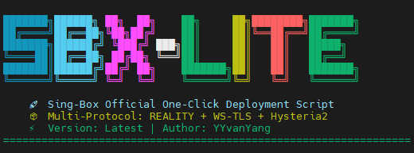

# sbx-lite - 官方 sing-box 一键部署



**一键部署官方 sing-box**，默认启用 **VLESS-REALITY**（无证书、抗探测），可选启用 **VLESS-WS-TLS** 和 **Hysteria2**。安装完成自动打印客户端 URI。

> **Cloudflare 用户注意**：Reality/Hy2 需灰云，WS-TLS 可灰云/橙云

---

## 🚀 快速开始

**最简安装（推荐）- 仅 Reality**
```bash
DOMAIN=your.domain.com bash <(curl -fsSL https://raw.githubusercontent.com/YYvanYang/sbx-lite/main/install_multi.sh)
```

**完整安装 - Reality + WS-TLS + Hysteria2**
```bash
DOMAIN=your.domain.com \
CERT_MODE=cf_dns \
CF_Token='your_cloudflare_token' \
bash <(curl -fsSL https://raw.githubusercontent.com/YYvanYang/sbx-lite/main/install_multi.sh)
```

---

## 🔧 安装选项

**使用现有证书**
```bash
DOMAIN=your.domain.com \
CERT_FULLCHAIN=/path/to/fullchain.pem \
CERT_KEY=/path/to/privkey.pem \
bash <(curl -fsSL https://raw.githubusercontent.com/YYvanYang/sbx-lite/main/install_multi.sh)
```

**HTTP-01 自动证书（需开放 80 端口）**
```bash
DOMAIN=your.domain.com \
CERT_MODE=le_http \
bash <(curl -fsSL https://raw.githubusercontent.com/YYvanYang/sbx-lite/main/install_multi.sh)
```

---

## 🗑️ 卸载

```bash
FORCE=1 bash <(curl -fsSL https://raw.githubusercontent.com/YYvanYang/sbx-lite/main/install_multi.sh) uninstall
```

---

## 📋 管理命令

安装后会自动创建管理命令 `sbx`（全称 `sbx-manager`）：

```bash
# 查看配置信息（包含所有 URI）
sbx info

# 检查服务状态
sbx status

# 重启服务
sbx restart

# 查看实时日志
sbx log

# 验证配置
sbx check

# 启动/停止服务
sbx start
sbx stop
```

**传统 systemctl 命令仍然可用**：
```bash
systemctl status sing-box
systemctl restart sing-box
journalctl -u sing-box -f
```

**配置文件位置**：`/etc/sing-box/config.json`  
**默认端口**：443(Reality), 8444(WS-TLS), 8443(Hy2)

---

## ❓ 故障排查

**Reality 连不通**
- 确认域名是灰云（DNS only）
- 检查 443 端口是否被占用
- 确认系统时间正确
- **v2rayN 用户**：需要在设置中将 VLESS 内核切换为 sing-box（默认是 Xray）

**Hysteria2 不工作**
- 确认有证书且 UDP 端口开放
- 检查防火墙设置

**重新配置**
- 直接重新运行安装命令即可覆盖

## 🔨 客户端兼容性

**sing-box 服务端兼容的客户端**：
- **NekoRay/NekoBox**（推荐，原生支持 sing-box）
- **v2rayN**（需切换内核：设置 → Core 类型设置 → VLESS → 选择 sing-box）
- **Shadowrocket**（iOS）
- **sing-box 官方客户端**

**注意**：v2rayN 默认使用 Xray 内核，需要手动切换到 sing-box 内核才能连接本脚本部署的 Reality 服务。

---

## 📄 许可证

MIT License - 基于官方 sing-box